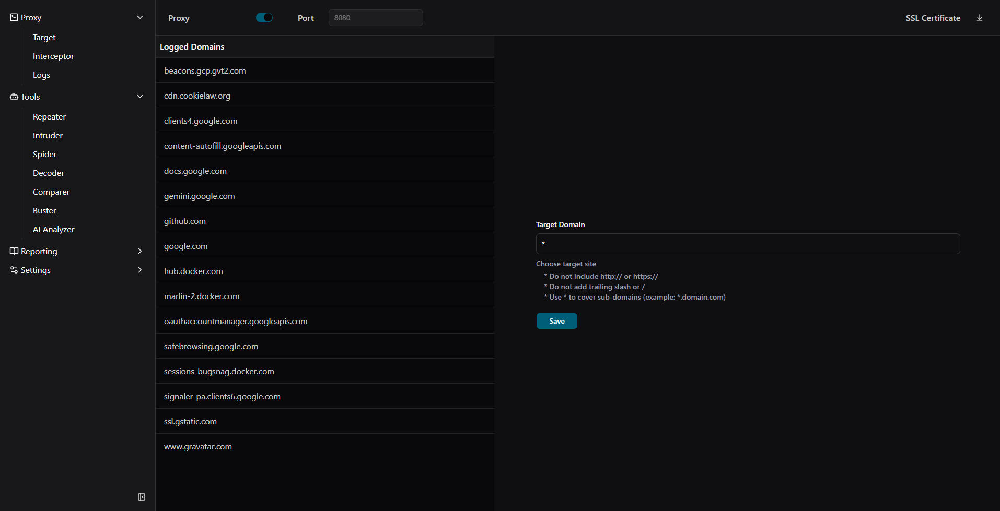
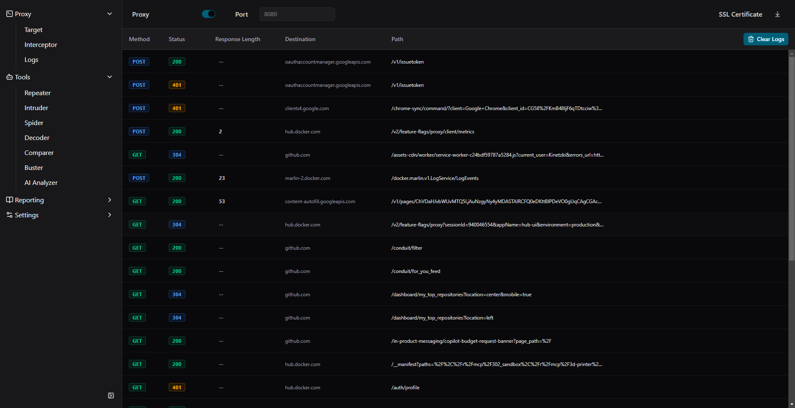
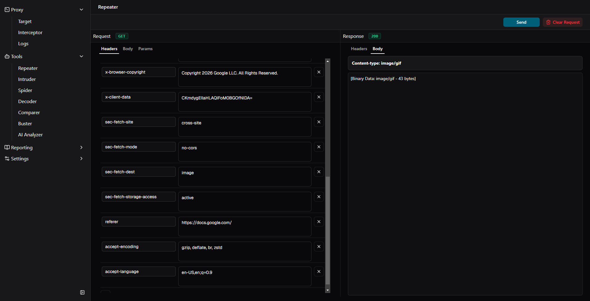
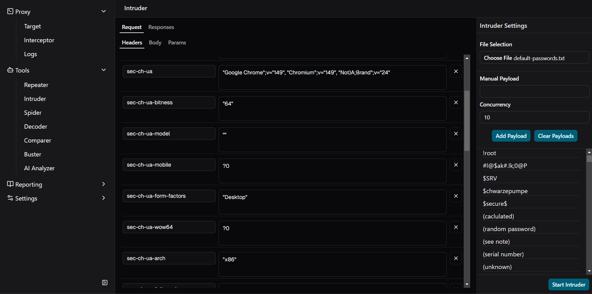

# Snorpy

**An open-source, desktop web security testing suite — built for pentesters who want a modern, hackable alternative.**

Snorpy is a cross-platform MITM proxy and offensive security toolkit. It runs as a local Electron app, intercepts HTTP(S) traffic, and gives you the core workflows you already know from tools like Burp Suite — Repeater, Intruder, request interception, and traffic logging — without the licensing friction.

> **Status:** Early and actively developed. Proxy, Repeater, and Intruder are working. Spider, Decoder, Comparer, and more are on the roadmap — see [What's next](#whats-next).

[](https://github.com/Kinetzki/snorpy/stargazers)
[](https://github.com/Kinetzki/snorpy/network/members)
[](https://github.com/Kinetzki/snorpy/issues)
[](https://github.com/Kinetzki/snorpy/pulls)
[](https://github.com/Kinetzki/snorpy/commits/main)
[](LICENSE)

[](https://www.electronjs.org/)
[](https://react.dev/)
[](https://www.typescriptlang.org/)
[](https://vitejs.dev/)
[](https://tailwindcss.com/)
[](https://github.com/httptoolkit/mockttp)

[](https://www.electronjs.org/)
[](https://github.com/Kinetzki/snorpy)
[](https://github.com/Kinetzki/snorpy/pulls)
[](https://github.com/Kinetzki/snorpy/issues)

---

## Screenshots

### Proxy — target scoping

Scope traffic to specific domains and browse captured hosts from the sidebar.



### Proxy — traffic logs

Inspect intercepted requests with method, status, length, destination, and path at a glance.



### Repeater

Edit headers and body, resend requests, and compare responses side-by-side.



### Intruder

Mark payload positions in requests, load wordlists, tune concurrency, and review fuzz results.



---

## Why Snorpy?

| | Burp / commercial suites | Snorpy |
|---|---|---|
| **Cost** | Paid licenses | Free & open source (Apache 2.0) |
| **Stack** | Closed, JVM-based | Electron + React + TypeScript — familiar to web devs |
| **Extensibility** | Limited without extensions API | Fork it, ship a feature, open a PR |
| **UI** | Dated | Modern dark UI with Monaco editor, Tailwind, shadcn/ui |

If you do web app pentests **or** build full-stack apps, you can contribute meaningfully here — whether that's a new fuzzing mode, a decoder tab, or making the proxy handle edge cases you've hit in the wild.

---

## Features

### Proxy

- **HTTP(S) intercepting proxy** powered by [mockttp](https://github.com/httptoolkit/mockttp), default port `8080`
- **Automatic CA certificate** generation and download for trusting HTTPS traffic
- **Target scoping** — filter by domain (`example.com`, `*.example.com`, or `*`)
- **Request interception** — hold, inspect, modify, forward, or drop in-flight requests
- **Traffic history** — browse captured requests and responses with syntax-highlighted viewers

### Repeater

- Send a captured request to Repeater and tweak headers, body, and URL
- Live response viewer with status-code styling
- Ideal for manual parameter tampering, auth bypass attempts, and quick PoCs

### Intruder

- **Payload fuzzing** with `§placeholder§` markers in URL, headers, or body
- Import payloads from `.txt` wordlists or add them one-by-one
- **Configurable concurrency** for rate-controlled attacks
- Results table with status, length, and timing — stop/resume supported

### Coming soon

The sidebar already sketches the roadmap: **Spider**, **Decoder**, **Comparer**, **Buster**, **AI Analyzer**, reporting (site map, log export), and settings. These are great first-contribution targets.

---

## Quick start

### Prerequisites

- [Node.js](https://nodejs.org/) 18+
- npm (comes with Node)

### Run from source

```bash
git clone https://github.com/Kinetzki/snorpy.git
cd snorpy
npm install
npm run dev
```

This starts the Vite dev server and launches the Electron app with hot reload.

### Use the proxy

1. Start the proxy from the **Proxy** panel (toggle it on).
2. Download the **CA certificate** and install it in your browser or OS trust store.
3. Point your browser or tool at `127.0.0.1:8080`.
4. Browse traffic under **Logs**, intercept under **Interceptor**, and send interesting requests to **Repeater** or **Intruder**.

### Build a distributable

```bash
npm run build
```

---

## Tech stack

| Layer | Tools |
|---|---|
| Desktop shell | [Electron](https://www.electronjs.org/) |
| UI | [React 18](https://react.dev/), [TypeScript](https://www.typescriptlang.org/), [Tailwind CSS 4](https://tailwindcss.com/), [shadcn/ui](https://ui.shadcn.com/) |
| State | [Zustand](https://zustand.docs.pmnd.rs/) |
| Editor | [Monaco Editor](https://microsoft.github.io/monaco-editor/) |
| Proxy engine | [mockttp](https://github.com/httptoolkit/mockttp) |
| HTTP client (Repeater / Intruder) | [axios](https://axios-http.com/) |
| Build | [Vite](https://vitejs.dev/) + [vite-plugin-electron](https://github.com/electron-vite/vite-plugin-electron) |

---

## Project structure

```
snorpy/
├── electron/           # Main process — proxy, certs, repeater, intruder
│   ├── main.ts
│   ├── proxy-manager.ts
│   ├── cert-manager.ts
│   ├── repeater.ts
│   └── intruder.ts
├── src/
│   ├── components/
│   │   ├── proxy/      # Target, Interceptor, Logs, controls
│   │   ├── tools/      # Repeater, Intruder
│   │   └── log/        # Request/response viewers
│   ├── stores/         # Zustand stores (App, Proxy, Repeater, Intruder)
│   └── interfaces/     # Shared TypeScript types
└── public/
```

**IPC boundary:** The renderer talks to the main process through `window.snorpy` (defined in `electron/preload.ts`). Proxy events flow in; Repeater/Intruder commands flow out.

---

## Contributing

Contributions are welcome — bug reports, feature PRs, docs, and UX polish all help.

### Good first issues

- **Decoder tab** — base64, URL encode/decode, hex, JWT parse
- **Comparer** — diff two responses side-by-side
- **Spider** — crawl in-scope links from proxy history
- **Export logs** — HAR or JSON export from the Logs view
- **Proxy edge cases** — WebSocket support, chunked encoding, malformed headers
- **Intruder modes** — pitchfork, cluster bomb, grep/match rules on responses
- **Tests** — unit tests for `electron/parser.ts`, placeholder substitution in Intruder

### Development workflow

1. Fork the repo and create a branch: `git checkout -b feat/my-feature`
2. Make your changes and keep PRs focused — one feature or fix per PR
3. Run the linter before opening a PR:

   ```bash
   npm run lint
   ```

4. Open a PR against `main` with a short description of **what** changed and **why**

### Code conventions

- Match existing patterns: functional React components, Zustand for state, TypeScript interfaces in `src/interfaces/`
- Main-process logic stays in `electron/`; UI stays in `src/`
- Prefer small, readable diffs over large refactors unless discussed in an issue first

Don't see your idea on the list? [Open an issue](https://github.com/Kinetzki/snorpy/issues) to discuss it before investing a lot of time.

---

## What's next

High-level roadmap (not set in stone — community input welcome):

- [ ] Spider / site map crawler
- [ ] Decoder & Comparer utilities
- [ ] Content discovery (Buster)
- [ ] Response analysis helpers (grep, extract, match rules)
- [ ] HAR import/export
- [ ] Project & scope persistence
- [ ] Plugin or extension hook (TBD)

Star the repo if you want updates, and watch **Releases** for packaged builds as they land.

---

## Legal & ethical use

Snorpy is intended for **authorized security testing only**. Only intercept and attack systems you own or have explicit written permission to test. The authors and contributors are not responsible for misuse.

---

## License

[Apache License 2.0](LICENSE)
